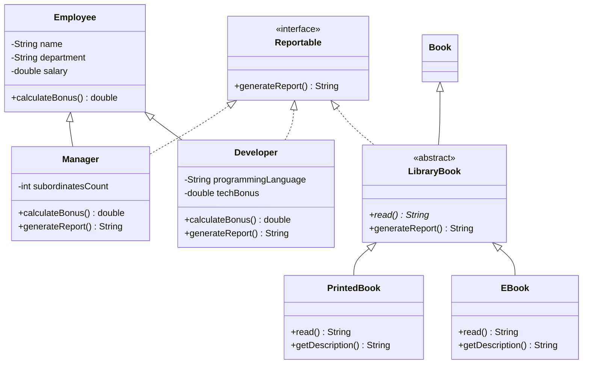

# Отчёт по лабораторной работе №3

### 1. Титульный лист

**Лабораторная работа №3**  
по дисциплине: «Объектно-ориентированное программирование»  
на тему: «Наследование и полиморфизм»

**Выполнил:**  
Студент группы ИИ21/1  
Саврико Илья

---

### 2. Цель и задачи работы

**Цель работы:** освоить наследование, переопределение методов и работу с объектами через общий базовый тип и интерфейс.

**Задачи работы:**

1. Построить иерархию сотрудников и вычислять премию в зависимости от типа сотрудника.
2. Использовать `super` для общей инициализации и формирования описания.
3. Вызвать разные реализации методов через массив базового типа.
4. Реализовать `Reportable` и обработать список через этот интерфейс.
5. Показать абстрактный метод и сохранить связь с классом `Book` предыдущей работы.
6. Проверить расчёты, валидацию и наследуемое поведение тестами.

Источник: [Lab3.md](https://github.com/Natali2531/Study/blob/main/Лабораторные%20работы%20по%20ООП/Lab3.md), проверен 09.10.2026. Обязательное задание использует сотрудников, поэтому оно выполнено буквально. Небольшая дополнительная иерархия книг сохраняет предметную область согласно AGENTS.md. Индивидуальные варианты не выполнялись; совпадение обязательного задания с названием варианта 1 не означает выбор этого варианта.

---

### 3. Краткое теоретическое введение

Наследование задаёт отношение «является»: менеджер является сотрудником. Ключевое слово `extends` связывает подкласс с базовым классом; `super(...)` инициализирует базовую часть объекта. Приватные поля сотрудника доступны подклассам через getter-методы, поэтому наследование не требует раскрывать внутреннее состояние через `protected`-поля. Переопределение (overriding) изменяет реализацию унаследованного метода; `@Override` позволяет компилятору проверить, что метод действительно переопределяет существующий.

Полиморфизм подтипов позволяет поместить разных сотрудников в `Employee[]` и вызвать один метод `calculateBonus()`. Позднее связывание (dynamic dispatch) выбирает реализацию по фактическому классу объекта во время выполнения. Перегрузка (overloading), изученная ранее, отличается: вариант с другим списком параметров выбирается компилятором. Вызов `super.toString()` явно использует базовую реализацию и дополняет её сведениями о конкретном сотруднике.

Абстрактный класс объединяет общее состояние и поведение, оставляя отдельные операции подклассам. `LibraryBook` содержит абстрактный `read()`, реализованный печатной и электронной книгами. Интерфейс задаёт независимый контракт: сотрудники и книги способны формировать отчёт через `Reportable`, хотя не принадлежат одной иерархии. Класс может наследовать один класс и реализовывать несколько интерфейсов. Модификатор `final` ограничивает дальнейшее наследование, переопределение или повторное присваивание в зависимости от места применения.

---

### 4. Структура проекта и диаграмма

```text
lab03-inheritance-polymorphism/
├── data/README.md
├── docs/
│   ├── hierarchy.md
│   ├── images/README.md
│   └── prompts/README.md
├── src/
│   ├── Employee.java
│   ├── Manager.java
│   ├── Developer.java
│   ├── Reportable.java
│   ├── Book.java
│   ├── LibraryBook.java
│   ├── PrintedBook.java
│   ├── EBook.java
│   └── Main.java
├── test/
│   ├── EmployeeTest.java
│   ├── LibraryBookTest.java
│   └── BookTest.java
├── pom.xml
└── README.md
```

Диаграмма подготовлена перед реализацией. Её отдельная версия: [docs/hierarchy.md](docs/hierarchy.md).



Премии сотрудников:

| Тип | Формула | Пример |
| --- | --- | --- |
| `Employee` | `salary × 0.05` | 60 000 → 3 000 |
| `Manager` | `salary × 0.15` | 150 000 → 22 500 |
| `Developer` | `salary × 0.10 + techBonus` | 120 000 и 3 000 → 15 000 |

`Employee` оставлен конкретным: обязательная часть задаёт обычного сотрудника с базовой премией. Абстрактный класс показан на `LibraryBook`. Это также позволяет включить в массив сотрудника, который не реализует `Reportable`, и продемонстрировать отбор по интерфейсу.

---

### 5. Листинги программного кода с пояснениями

#### 5.1. Класс `Employee`

Базовые данные хранятся в приватных `final`-полях. Getter-методы доступны подклассам, а ставки вынесены в именованные константы. Пустые строки, отрицательная зарплата и нечисловые или бесконечные значения отклоняются.

```java
/** Сотрудник с базовой премией в размере пяти процентов зарплаты. */
public class Employee {
    private static final double BASE_BONUS_RATE = 0.05;

    private final String name;
    private final String department;
    private final double salary;

    /**
     * Создаёт сотрудника с проверкой исходных данных.
     * @param name непустое имя
     * @param department непустое название отдела
     * @param salary конечная неотрицательная зарплата
     * @throws IllegalArgumentException если данные некорректны
     */
    public Employee(String name, String department, double salary) {
        this.name = requireText(name, "Имя");
        this.department = requireText(department, "Отдел");
        this.salary = requireNonNegative(salary, "Зарплата");
    }

    /** @return имя сотрудника */
    public final String getName() {
        return name;
    }

    /** @return отдел сотрудника */
    public final String getDepartment() {
        return department;
    }

    /** @return зарплата сотрудника */
    public final double getSalary() {
        return salary;
    }

    /** @return базовая премия: 5% зарплаты */
    public double calculateBonus() {
        return salary * BASE_BONUS_RATE;
    }

    /** @return имя и отдел сотрудника */
    @Override
    public String toString() {
        return name + " (" + department + ")";
    }

    protected static String requireText(String value, String fieldName) {
        if (value == null || value.isBlank()) {
            throw new IllegalArgumentException(fieldName + " не может быть пустым");
        }
        return value;
    }

    protected static double requireNonNegative(double value, String fieldName) {
        if (!Double.isFinite(value) || value < 0) {
            throw new IllegalArgumentException(fieldName + " должен быть конечным и неотрицательным");
        }
        return value;
    }
}
```

#### 5.2. Класс `Manager`

Конструктор начинает с `super(...)`. Переопределённая премия равна 15% зарплаты; описание расширяет `super.toString()`. Отчёт содержит количество подчинённых и явно обозначенную заглушку списка.

```java
/** Менеджер с премией 15% и отчётом о подчинённых. */
public final class Manager extends Employee implements Reportable {
    private static final double MANAGER_BONUS_RATE = 0.15;
    private final int subordinatesCount;

    /**
     * Создаёт менеджера.
     * @param name имя
     * @param department отдел
     * @param salary зарплата
     * @param subordinatesCount неотрицательное число подчинённых
     * @throws IllegalArgumentException если данные некорректны
     */
    public Manager(String name, String department, double salary, int subordinatesCount) {
        super(name, department, salary);
        if (subordinatesCount < 0) {
            throw new IllegalArgumentException("Число подчинённых не может быть отрицательным");
        }
        this.subordinatesCount = subordinatesCount;
    }

    /** @return число подчинённых */
    public int getSubordinatesCount() {
        return subordinatesCount;
    }

    /** @return премия менеджера: 15% зарплаты */
    @Override
    public double calculateBonus() {
        return getSalary() * MANAGER_BONUS_RATE;
    }

    /** @return описание менеджера с числом подчинённых */
    @Override
    public String toString() {
        return super.toString() + " — менеджер, подчинённых: " + subordinatesCount;
    }

    /** @return отчёт с явно обозначенной заглушкой списка подчинённых */
    @Override
    public String generateReport() {
        return "Отчёт менеджера " + getName() + ": подчинённых — " + subordinatesCount
                + "; список подчинённых: [заглушка]";
    }
}
```

#### 5.3. Класс `Developer`

Премия складывается из 10% зарплаты и технического бонуса. Язык программирования и бонус проверяются при создании. Список завершённых задач в отчёте явно обозначен как заглушка; вымышленные реальные задачи не подставляются.

```java
/** Разработчик с премией 10% зарплаты и дополнительным техническим бонусом. */
public final class Developer extends Employee implements Reportable {
    private static final double DEVELOPER_BONUS_RATE = 0.10;
    private final String programmingLanguage;
    private final double techBonus;

    /**
     * Создаёт разработчика.
     * @param name имя
     * @param department отдел
     * @param salary зарплата
     * @param programmingLanguage непустое название языка программирования
     * @param techBonus конечный неотрицательный дополнительный бонус
     * @throws IllegalArgumentException если данные некорректны
     */
    public Developer(String name, String department, double salary,
                     String programmingLanguage, double techBonus) {
        super(name, department, salary);
        this.programmingLanguage = requireText(programmingLanguage, "Язык программирования");
        this.techBonus = requireNonNegative(techBonus, "Технический бонус");
    }

    /** @return язык программирования */
    public String getProgrammingLanguage() {
        return programmingLanguage;
    }

    /** @return дополнительный технический бонус */
    public double getTechBonus() {
        return techBonus;
    }

    /** @return премия: 10% зарплаты плюс технический бонус */
    @Override
    public double calculateBonus() {
        return getSalary() * DEVELOPER_BONUS_RATE + techBonus;
    }

    /** @return описание разработчика с языком программирования */
    @Override
    public String toString() {
        return super.toString() + " — разработчик, язык: " + programmingLanguage;
    }

    /** @return отчёт с явно обозначенной заглушкой списка задач */
    @Override
    public String generateReport() {
        return "Отчёт разработчика " + getName() + ": завершённые задачи: [заглушка]";
    }
}
```

#### 5.4. Класс `Reportable`

Контракт используется независимо от происхождения объекта. В общем списке находятся и сотрудники, и книги.

```java
/** Контракт формирования текстового отчёта независимо от иерархии классов. */
public interface Reportable {
    /**
     * Формирует отчёт о текущем объекте.
     * @return текст отчёта
     */
    String generateReport();
}
```

#### 5.5. Класс `Book`

Класс и его 14 тестов перенесены из второй лабораторной. Сохранены конструкторы, счётчик, фабрика и перегрузка описания. Их исходные файлы во второй лабораторной не изменяются.

```java
import java.time.Year;

/**
 * Представляет книгу с идентификатором, названием, автором и годом издания.
 */
public class Book {
    private static int counter;

    private long id;
    private String title;
    private String author;
    private int year;

    /** Создаёт книгу с незаданными идентификатором и годом. */
    public Book() {
        this(0, "Без названия", "Неизвестен", 0);
    }

    /**
     * Создаёт книгу без идентификатора и года издания.
     * @param title название книги
     * @param author автор книги
     */
    public Book(String title, String author) {
        this(0, title, author, 0);
    }

    /**
     * Создаёт книгу без идентификатора.
     * @param title название книги
     * @param author автор книги
     * @param year год издания от 0 до текущего года
     */
    public Book(String title, String author, int year) {
        this(0, title, author, year);
    }

    /**
     * Создаёт книгу и проверяет переданные значения через сеттеры.
     *
     * @param id неотрицательный идентификатор, 0 означает, что он не задан
     * @param title название книги
     * @param author автор книги
     * @param year год издания от 0 до текущего года
     */
    public Book(long id, String title, String author, int year) {
        setId(id);
        setTitle(title);
        setAuthor(author);
        setYear(year);
        counter++;
    }

    /**
     * Возвращает число успешно созданных книг за время работы JVM.
     * @return количество созданных объектов, независимо от способа создания
     */
    public static int getCounter() {
        return counter;
    }

    /**
     * Создаёт книгу с ID, равным порядковому номеру создания объекта.
     * Явно заданные ID конструкторов и сеттера не проверяются на уникальность.
     * Предназначен для однопоточного учебного приложения.
     * @param title название книги
     * @param author автор книги
     * @param year год издания от 0 до текущего года
     * @return новая книга с автоматически назначенным идентификатором
     * @throws IllegalArgumentException если данные книги некорректны
     */
    public static Book createBook(String title, String author, int year) {
        return new Book((long) counter + 1, title, author, year);
    }

    /**
     * Возвращает идентификатор книги.
     *
     * @return идентификатор книги
     */
    public long getId() {
        return id;
    }

    /**
     * Устанавливает идентификатор книги.
     *
     * @param id неотрицательный идентификатор (0 — не задан)
     * @throws IllegalArgumentException если идентификатор отрицательный
     */
    public void setId(long id) {
        if (id < 0) {
            throw new IllegalArgumentException("Идентификатор не может быть отрицательным");
        }
        this.id = id;
    }

    /**
     * Возвращает название книги.
     *
     * @return название книги
     */
    public String getTitle() {
        return title;
    }

    /**
     * Устанавливает название книги.
     *
     * @param title непустое название
     * @throws IllegalArgumentException если название равно {@code null} или пусто
     */
    public void setTitle(String title) {
        if (title == null || title.isBlank()) {
            throw new IllegalArgumentException("Название не может быть пустым");
        }
        this.title = title;
    }

    /**
     * Возвращает автора книги.
     *
     * @return автор книги
     */
    public String getAuthor() {
        return author;
    }

    /**
     * Устанавливает автора книги.
     *
     * @param author непустое имя автора
     * @throws IllegalArgumentException если автор равен {@code null} или пуст
     */
    public void setAuthor(String author) {
        if (author == null || author.isBlank()) {
            throw new IllegalArgumentException("Автор не может быть пустым");
        }
        this.author = author;
    }

    /**
     * Возвращает год издания книги.
     *
     * @return год издания
     */
    public int getYear() {
        return year;
    }

    /**
     * Устанавливает год издания книги.
     *
     * @param year год от 0 до текущего включительно
     * @throws IllegalArgumentException если год находится вне допустимого диапазона
     */
    public void setYear(int year) {
        int currentYear = Year.now().getValue();
        if (year < 0 || year > currentYear) {
            throw new IllegalArgumentException("Год должен быть в диапазоне от 0 до " + currentYear);
        }
        this.year = year;
    }

    /**
     * Формирует полное описание книги.
     *
     * @return описание в формате «Название» — Автор (год)
     */
    public String getDescription() {
        return "\"%s\" — %s (%d)".formatted(title, author, year);
    }

    /**
     * Формирует описание книги в выбранном формате.
     * @param shortFormat true — только название и год, false — полное описание
     * @return описание книги
     */
    public String getDescription(boolean shortFormat) {
        return shortFormat ? "%s (%d)".formatted(title, year) : getDescription();
    }

    /**
     * Возвращает строковое представление книги.
     *
     * @return краткое описание книги
     */
    @Override
    public String toString() {
        return getDescription();
    }
}
```

#### 5.6. Класс `LibraryBook`

Абстрактная книга вызывает конструктор `Book` и задаёт обязательный метод `read()`. Общая реализация отчёта использует методы объекта, поэтому включает описание и способ чтения конкретного подкласса.

```java
/** Абстрактная библиотечная книга с общим отчётом и способом чтения. */
public abstract class LibraryBook extends Book implements Reportable {
    /**
     * Инициализирует поля через конструктор Book из второй лабораторной.
     * @param id идентификатор
     * @param title название
     * @param author автор
     * @param year год издания
     */
    protected LibraryBook(long id, String title, String author, int year) {
        super(id, title, author, year);
    }

    /** @return способ чтения, определяемый конкретным видом книги */
    public abstract String read();

    /** @return описание книги и способ чтения */
    @Override
    public String generateReport() {
        return getDescription() + "; " + read();
    }
}
```

#### 5.7. Класс `PrintedBook`

Реализует чтение печатной книги и расширяет описание через `super.getDescription()`.

```java
/** Печатная библиотечная книга. */
public final class PrintedBook extends LibraryBook {
    /**
     * Создаёт печатную книгу.
     * @param id идентификатор
     * @param title название
     * @param author автор
     * @param year год издания
     */
    public PrintedBook(long id, String title, String author, int year) {
        super(id, title, author, year);
    }

    /** @return полное описание с видом книги */
    @Override
    public String getDescription() {
        return super.getDescription() + " — печатная книга";
    }

    /** @return способ чтения печатной книги */
    @Override
    public String read() {
        return "Читать бумажные страницы";
    }
}
```

#### 5.8. Класс `EBook`

Реализует чтение электронной книги. Вызов наследуемых `toString()` и `getDescription(false)` также использует переопределённое полное описание.

```java
/** Электронная библиотечная книга. */
public final class EBook extends LibraryBook {
    /**
     * Создаёт электронную книгу.
     * @param id идентификатор
     * @param title название
     * @param author автор
     * @param year год издания
     */
    public EBook(long id, String title, String author, int year) {
        super(id, title, author, year);
    }

    /** @return полное описание с видом книги */
    @Override
    public String getDescription() {
        return super.getDescription() + " — электронная книга";
    }

    /** @return способ чтения электронной книги */
    @Override
    public String read() {
        return "Читать на электронной читалке";
    }
}
```

#### 5.9. Класс `Main`

Массив содержит ровно пять сотрудников: двух менеджеров, двух разработчиков и обычного сотрудника. Цикл вызывает виртуальный метод премии. Pattern matching в `instanceof` получает ссылку типа `Reportable` без явного приведения. Форматирование с `Locale.ROOT` обеспечивает одинаковую десятичную точку при разных настройках системы. Затем демонстрируются две книги и общий список отчётов.

```java
import java.util.ArrayList;
import java.util.List;
import java.util.Locale;

/** Демонстрирует наследование и полиморфизм в лабораторной работе №3. */
public final class Main {
    private Main() {
    }

    /**
     * Показывает премии, отчёты и способы чтения книг.
     * @param args аргументы командной строки, не используются
     */
    public static void main(String[] args) {
        Employee[] employees = {
                new Manager("Иванов", "IT", 150000, 5),
                new Developer("Петров", "IT", 120000, "Java", 3000),
                new Employee("Сидоров", "Библиотека", 60000),
                new Manager("Смирнова", "Библиотека", 90000, 3),
                new Developer("Кузнецова", "IT", 100000, "Python", 5000)
        };
        List<Reportable> reporters = new ArrayList<>();
        printBonuses(employees, reporters);
        System.out.println("\n=== Интерфейс Reportable ===");
        printReports(reporters);
        demonstrateBooks(reporters);
    }

    private static void printBonuses(Employee[] employees, List<Reportable> reporters) {
        System.out.println("=== Полиморфизм ===");
        for (Employee employee : employees) {
            System.out.printf(Locale.ROOT, "%s — бонус: %.2f руб.%n",
                    employee, employee.calculateBonus());
            if (employee instanceof Reportable reporter) {
                reporters.add(reporter);
            }
        }
    }

    private static void demonstrateBooks(List<Reportable> reporters) {
        LibraryBook[] books = {
                new PrintedBook(1, "Война и мир", "Толстой Л.Н.", 1869),
                new EBook(2, "Мастер и Маргарита", "Булгаков М.А.", 1967)
        };
        System.out.println("\n=== Книги: абстрактный класс ===");
        for (LibraryBook book : books) {
            System.out.println(book.getDescription() + "; " + book.read());
            reporters.add(book);
        }
        System.out.println("Создано книг: " + Book.getCounter());
        System.out.println("\n=== Общий список Reportable: сотрудники и книги ===");
        printReports(reporters);
    }

    private static void printReports(List<Reportable> reporters) {
        for (Reportable reporter : reporters) {
            System.out.println(reporter.generateReport());
        }
    }
}
```

#### 5.10. Модульные тесты

Все 26 тестов распределены по трём классам:

| Класс | Количество | Что проверяется |
| --- | --- | --- |
| `EmployeeTest` | 8 | Формулы, вызов через базовый тип, поля, описания, отчёты, допустимый ноль и ошибочные данные |
| `LibraryBookTest` | 4 | Абстрактный тип, наследуемое форматирование, независимый контракт отчёта, общий счётчик и валидация |
| `BookTest` | 14 | Поведение `Book` из второй лабораторной |

Пример проверки позднего связывания:

```java
    @Test
    void arrayOfBaseTypeDispatchesToActualImplementations() {
        Employee[] employees = {
                new Employee("А", "Отдел", 100000),
                new Manager("Б", "Отдел", 100000, 5),
                new Developer("В", "Отдел", 100000, "Java", 3000)
        };
        double[] expectedBonuses = {5000, 15000, 13000};
        for (int index = 0; index < employees.length; index++) {
            assertEquals(expectedBonuses[index], employees[index].calculateBonus(), DELTA);
        }
    }

```

Полные листинги тестов: [EmployeeTest.java](test/EmployeeTest.java), [LibraryBookTest.java](test/LibraryBookTest.java), [BookTest.java](test/BookTest.java).

#### 5.11. Настройка Maven

Java API и байткод ограничены версией 17. Используются плоские каталоги исходников и тестов, JUnit 5 и исполняемый JAR с `Main` в манифесте.

```xml
<?xml version="1.0" encoding="UTF-8"?>
<project xmlns="http://maven.apache.org/POM/4.0.0"
         xmlns:xsi="http://www.w3.org/2001/XMLSchema-instance"
         xsi:schemaLocation="http://maven.apache.org/POM/4.0.0 https://maven.apache.org/xsd/maven-4.0.0.xsd">
    <modelVersion>4.0.0</modelVersion>

    <groupId>com.university</groupId>
    <artifactId>lab03-inheritance-polymorphism</artifactId>
    <version>1.0.0</version>

    <properties>
        <maven.compiler.release>17</maven.compiler.release>
        <project.build.sourceEncoding>UTF-8</project.build.sourceEncoding>
        <junit.version>5.11.4</junit.version>
    </properties>

    <dependencies>
        <dependency>
            <groupId>org.junit.jupiter</groupId>
            <artifactId>junit-jupiter</artifactId>
            <version>${junit.version}</version>
            <scope>test</scope>
        </dependency>
    </dependencies>

    <build>
        <sourceDirectory>src</sourceDirectory>
        <testSourceDirectory>test</testSourceDirectory>
        <plugins>
            <plugin>
                <groupId>org.apache.maven.plugins</groupId>
                <artifactId>maven-compiler-plugin</artifactId>
                <version>3.13.0</version>
            </plugin>
            <plugin>
                <groupId>org.apache.maven.plugins</groupId>
                <artifactId>maven-surefire-plugin</artifactId>
                <version>3.5.2</version>
            </plugin>
            <plugin>
                <groupId>org.apache.maven.plugins</groupId>
                <artifactId>maven-jar-plugin</artifactId>
                <version>3.4.2</version>
                <configuration>
                    <archive>
                        <manifest>
                            <mainClass>Main</mainClass>
                        </manifest>
                    </archive>
                </configuration>
            </plugin>
        </plugins>
    </build>
</project>
```

Модель использует `double` по условию учебного задания. Для реальных денежных расчётов понадобятся отдельные правила округления и денежный тип. Общий счётчик книг предназначен для однопоточного запуска; ручные ID не проверяются на уникальность и не сохраняются между запусками. Новые типы книг не добавляют собственных валидируемых полей, поэтому проверка базовых данных выполняется до увеличения счётчика в `Book`.

---

### 6. Протокол работы программы

Фактический вывод проверочного запуска JAR 09.10.2026. Это текстовый протокол запуска при подготовке проекта; пользовательский скриншот добавляется отдельно.

```text
=== Полиморфизм ===
Иванов (IT) — менеджер, подчинённых: 5 — бонус: 22500.00 руб.
Петров (IT) — разработчик, язык: Java — бонус: 15000.00 руб.
Сидоров (Библиотека) — бонус: 3000.00 руб.
Смирнова (Библиотека) — менеджер, подчинённых: 3 — бонус: 13500.00 руб.
Кузнецова (IT) — разработчик, язык: Python — бонус: 15000.00 руб.

=== Интерфейс Reportable ===
Отчёт менеджера Иванов: подчинённых — 5; список подчинённых: [заглушка]
Отчёт разработчика Петров: завершённые задачи: [заглушка]
Отчёт менеджера Смирнова: подчинённых — 3; список подчинённых: [заглушка]
Отчёт разработчика Кузнецова: завершённые задачи: [заглушка]

=== Книги: абстрактный класс ===
"Война и мир" — Толстой Л.Н. (1869) — печатная книга; Читать бумажные страницы
"Мастер и Маргарита" — Булгаков М.А. (1967) — электронная книга; Читать на электронной читалке
Создано книг: 2

=== Общий список Reportable: сотрудники и книги ===
Отчёт менеджера Иванов: подчинённых — 5; список подчинённых: [заглушка]
Отчёт разработчика Петров: завершённые задачи: [заглушка]
Отчёт менеджера Смирнова: подчинённых — 3; список подчинённых: [заглушка]
Отчёт разработчика Кузнецова: завершённые задачи: [заглушка]
"Война и мир" — Толстой Л.Н. (1869) — печатная книга; Читать бумажные страницы
"Мастер и Маргарита" — Булгаков М.А. (1967) — электронная книга; Читать на электронной читалке
```

**Место для пользовательского скриншота:** сохраните снимок своего запуска в `docs/images/program-output.png` и замените этот абзац вставкой:

```markdown

```

---

### 7. Выписка из журнала применения ИИ

Фактически применялся OpenAI Codex. [Полный журнал](docs/prompts/README.md) содержит десять последовательных этапов в виде реконструированного сценария. Формулировки не являются дословной перепиской. Использование других ИИ-инструментов не заявляется.

Промпт сценария: «Проверь, что расчёт премии через ссылку Employee вызывает реализацию конкретного подкласса, а Reportable работает для разных иерархий». Результат: добавлены тесты массива базового типа и общего списка сотрудников и книг. Критический анализ: сравниваются конкретные расчёты и отчёты; наличие наследования само по себе ещё не подтверждает правильный выбор реализации. Изменения: формулы вынесены в подклассы, в цикле отсутствует ручной выбор формулы по типу.

---

### 8. Ответы на контрольные вопросы

1. **Что такое наследование? Какое отношение оно моделирует?**  
   Создание нового класса на основе существующего с возможностью добавить состояние и поведение. Моделирует отношение «является» (is-a): `Manager` является `Employee`. Конструкторы не наследуются; базовая часть инициализируется конструктором базового класса.

2. **Что такое переопределение методов? Чем отличается от перегрузки?**  
   Подкласс задаёт свою реализацию унаследованного метода с той же сигнатурой и совместимым возвращаемым типом. Доступ нельзя сузить; проверяемые исключения нельзя расширить. Перегрузка использует другой список параметров и выбирается при компиляции. Изменение только возвращаемого типа не создаёт перегрузку. Статические методы скрываются, а не переопределяются.

3. **Что такое полиморфизм? Приведите пример.**  
   Возможность работать с разными объектами через общий тип. При `employee.calculateBonus()` в цикле по `Employee[]` обычный сотрудник получает 5%, менеджер — 15%, разработчик — 10% плюс технический бонус. Реализация определяется фактическим типом объекта.

4. **Что такое абстрактный класс? Можно ли создать его объект?**  
   Класс с модификатором `abstract`; непосредственно создать его экземпляр нельзя. Он может содержать поля, конструкторы, обычные и абстрактные методы. Наличие абстрактного метода требует абстрактного класса, но абстрактный класс может не иметь таких методов. `LibraryBook` оставляет реализацию `read()` конкретным подклассам.

5. **Что такое интерфейс? Чем отличается от абстрактного класса?**  
   Интерфейс задаёт контракт поведения без состояния экземпляра и конструкторов. Его поля — `public static final`, а методы могут быть абстрактными, `default`, статическими и приватными вспомогательными. Абстрактный класс может хранить состояние экземпляра и иметь конструкторы. `Reportable` объединяет сотрудников и книги по способности формировать отчёт.

6. **Может ли класс наследовать несколько классов? Реализовывать несколько интерфейсов?**  
   В Java у класса только один непосредственный базовый класс; реализуемых интерфейсов может быть несколько. Интерфейс тоже может расширять несколько интерфейсов. При конфликте методов `default` может потребоваться явная реализация в классе.

7. **Для чего нужна аннотация `@Override`?**  
   Позволяет компилятору проверить, что метод переопределяет метод базового класса или реализует метод интерфейса. При ошибке в имени или параметрах компиляция завершится ошибкой. Аннотация не создаёт полиморфизм сама по себе, а проверяет намерение программиста.

8. **Что такое ключевое слово `super`?**  
   Используется для обращения к базовой части объекта: `super(...)` вызывает конструктор непосредственного базового класса, а `super.toString()` — его реализацию метода. В исходниках для Java 17 вызов конструктора стоит первым. Доступ к приватным полям базового класса через `super` запрещён.

9. **Когда применять абстрактный класс, а когда интерфейс?**  
   Абстрактный класс подходит для родственных сущностей с общим состоянием и инициализацией, например библиотечных книг. Интерфейс подходит для независимого контракта, общего для разных иерархий, например отчётности сотрудников и книг. Они могут применяться одновременно, как в `LibraryBook`.

10. **Что такое модификатор `final`? Какие ограничения он накладывает?**  
    `final`-класс нельзя расширить, `final`-метод нельзя переопределить, `final`-полю или локальной переменной нельзя повторно присвоить значение. Ссылка `final` не делает объект неизменяемым: содержимое объекта может меняться. Не каждое `final`-поле является константой времени компиляции. В работе конечные подклассы отмечены `final`, а поля сотрудников задаются один раз.

---

### 9. Выводы

Создана и проверена иерархия сотрудников с разными формулами премий. Общий массив демонстрирует позднее связывание, а `Reportable` позволяет обрабатывать отчёты без знания конкретного класса. Заглушки списков обозначены явно.

На основе `Book` из второй работы добавлена абстрактная библиотечная книга с двумя способами чтения. Сохранённые тесты подтверждают прежнее поведение, новые проверяют переопределение и общий интерфейс. Приватные поля, именованные ставки и единая проверка данных сохраняют понятную структуру без дополнительных слоёв.

---

### 10. Сборка, тестирование и запуск

Требуются JDK 17+ и Maven. Из папки `lab03-inheritance-polymorphism`:

```bash
mvn clean verify
java -jar target/lab03-inheritance-polymorphism-1.0.0.jar
```

Для тестов отдельно: `mvn test`. Дополнительные входные файлы не нужны.

В текущем окружении Maven отсутствует в PATH. Фактически выполнена команда Maven из IntelliJ IDEA с ранее подготовленным кешем зависимостей:

```bash
"/home/ilyshka/Загрузки/idea-2026.2.2/idea-IU-262.10315.125/plugins/maven-plugin/lib/maven3/bin/mvn" -o -Dmaven.repo.local=/tmp/lab02-maven-repository -B clean verify
```

Проверено 09.10.2026: Maven 3.9.16, OpenJDK 25.0.4.1, `BUILD SUCCESS`; 26 тестов без ошибок и пропусков; JAR успешно запущен. `javap -verbose` подтвердил major version 61, соответствующую Java 17. На самом JDK 17 запуск отдельно не выполнялся. Временный кеш `/tmp` не входит в проект; обычный Maven использует свой стандартный кеш.

В IntelliJ IDEA подключите `pom.xml` этой лабораторной через **Add as Maven Project**, затем запускайте её `src/Main.java` и тесты. Каждый проект использует собственные классы и каталог `target/`; подключать `src/` разных лабораторных как исходники одного модуля не следует.
