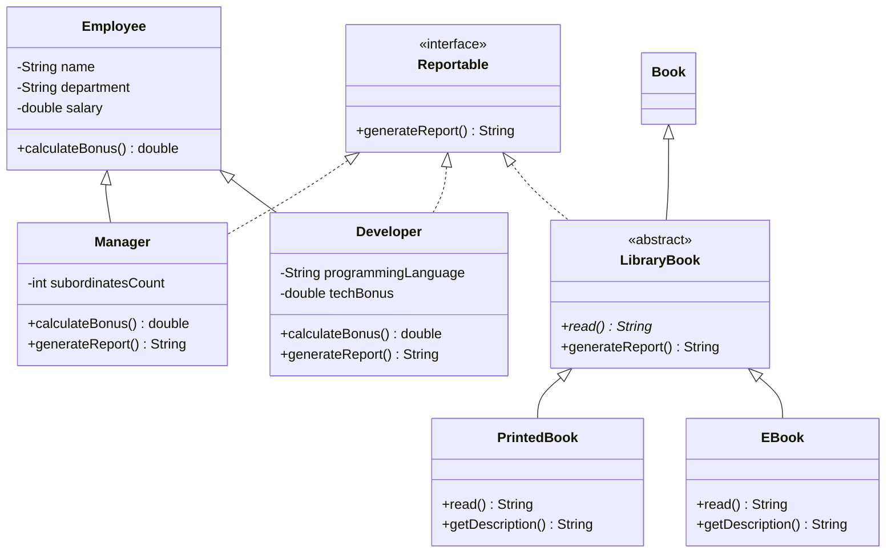

# Диаграмма классов

Схема подготовлена до реализации исходников. Иерархия сотрудников выполняет обязательное задание; иерархия книг сохраняет предметную область предыдущих работ и демонстрирует абстрактный метод. Обе используют независимый контракт Reportable.

